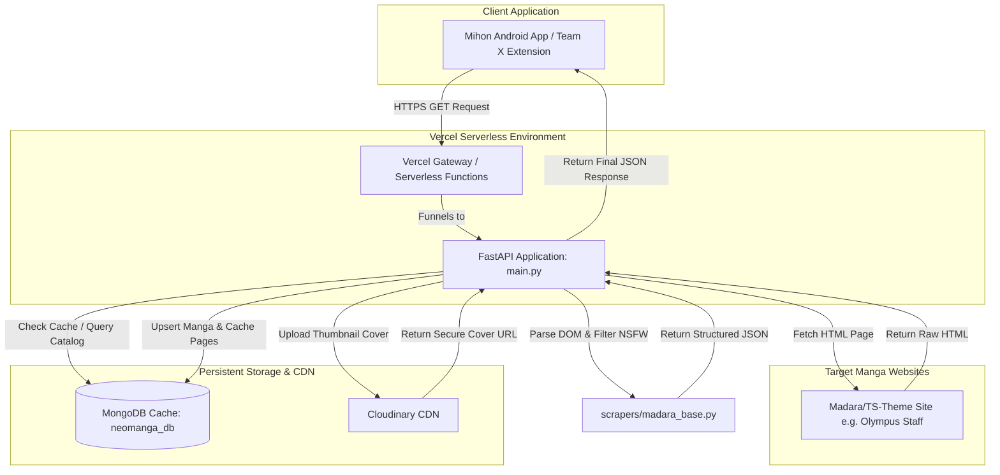

# Neo Manga Centralized Backend — System Architecture, Evolution & Refactoring Audit
**Author:** Elite Senior Systems Architect & Lead Developer  
**Status:** Completed Audit  
**Date:** July 13, 2026

---

## 1. Core Architecture & Exact Workflow

This section outlines the step-by-step lifecycle of data in the Neo Manga Backend Server, illustrating how a request propagates from the Tachiyomi/Mihon client through FastAPI, triggers scraping mechanisms, queries or updates MongoDB cache collections, and integrates with Cloudinary and Vercel Serverless Functions.



### Step-by-Step Data Flow Execution

#### Step 1: Endpoint Request Lifecycle
The FastAPI application ([main.py](file:///D:/neomangatest/neomanga-api-server/main.py)) exposes four primary API endpoints under the `/api/v1` prefix:
*   **`/api/v1/manga/latest`**: Scrapes and returns the most recently updated manga titles from a specified site.
*   **`/api/v1/manga/catalog`**: Serves paginated index catalogs.
*   **`/api/v1/manga/details`**: Returns metadata (description, genres) and the complete list of chapters, ordered chronologically from oldest (e.g., Chapter 1) to newest.
*   **`/api/v1/chapters/pages`**: Provides the reading page image URLs for a specific chapter.

When an HTTPS request arrives, FastAPI extracts query parameters such as `site_url`, `manga_url`, or `chapter_url` and validates their URL scheme (forcing `http://` or `https://`).

#### Step 2: Asynchronous Fetching & BeautifulSoup Parsing
If the data is not cached, the request is routed to [scrapers/madara_base.py](file:///D:/neomangatest/neomanga-api-server/scrapers/madara_base.py). 
1.  **Asynchronous Fetching**: The scraper instantiates an asynchronous `httpx.AsyncClient` with specialized headers (`HEADERS` containing a modern Chrome User-Agent, Accept-Language, and Accept headers) to mimic standard web browsers.
2.  **DOM Selection**: The returned HTML is parsed using `BeautifulSoup` with the `html.parser` engine. The DOM traversal features multi-selector configurations to accommodate both standard Madara structures and customized layouts (like Olympus Staff's TS-Theme selectors):
    *   **Catalog Page Selection**: Searches for containers matching `div.listupd div.bs div.bsx`, `.page-item-detail`, `.manga-item`, `.post-item`, `.manga-entry`, `.uta`, `.entry-box`, `.swiper-slide`, or `.bsx`.
    *   **Metadata Selection**: Synopses are parsed via `.summary__content`, `.manga-summary`, `.description-summary`, `.post-content_item`, or `.review-content`. Genres are extracted via `.genres-content a`, `.manga-genres a`, `.summary-content.genres a`, or `.review-author-info a`.
    *   **Chapter Selection**: Parses anchors matching `.wp-manga-chapter a`, `.chapter-link`, `.list-chapter a`, `.chapters a`, or general anchors containing `/chapter/` in the URL path.
    *   **Chapter Reading Pages**: Inspects elements within `.reading-content img`, `.page-break img`, `div.cha-img img`, `.wp-manga-chapter-img`, `.read-container img`, `.chapter-content img`, or `.entry-content img`.

#### Step 3: Strict NSFW Filtering
To maintain clean catalog data, all extracted titles are parsed through the `NSFW_BLOCKLIST` filter:
```python
NSFW_BLOCKLIST = ["+18", "18+", "محتوى غير لائق", "المحتوى غير لائق"]
```
If a title matches any of these keywords (case-insensitively), it is discarded before ingestion.

#### Step 4: MongoDB Ingestion, Deduplication, and Database Shielding
1.  **Slug Generation**: The title is converted into a clean slug using `generate_slug()` (forces lowercase, strips whitespace, converts special characters, spaces, and hyphens to a single hyphen, and filters out non-word characters).
2.  **Multi-Source Deduplication**: Rather than creating duplicate manga profiles, the server reads the target domain host (e.g. `olympustaff.com` -> `olympustaff_com`) as a unique nested field key inside the `sources` sub-object:
    ```json
    "sources": {
        "olympustaff_com": {
            "url": "https://olympustaff.com/series/manga-slug/",
            "latest_chapter": "الفصل 50",
            "updated_at": "2026-07-13T12:00:00.000000"
        }
    }
    ```
    This allows a single manga entry to consolidate metadata and URL pointers across multiple source sites.
3.  **Exception Shield & Timeout Limit**: The database client ([core/database.py](file:///D:/neomangatest/neomanga-api-server/core/database.py)) is configured with a 1-second timeout selection ceiling (`serverSelectionTimeoutMS=1000`). If a startup ping fails, the global boolean `IS_DB_ONLINE` is flagged as `False`. The ingestion functions block execution loops if the database is offline, preventing the endpoints from hanging.

#### Step 5: Cloudinary Image Storage
During manga catalog ingestion, if a raw cover thumbnail is found and does not belong to Cloudinary, the server triggers `upload_image_to_cloudinary()` targeting the `"neomanga/covers/"` folder. This downloads the cover image bytes (bypassing hotlinking protections) and uploads them to the Cloudinary cloud storage instance. The secure CDN URL is then cached in the MongoDB document.

#### Step 6: Background Synchronization Scheduler
The system runs `AsyncIOScheduler` from `apscheduler` inside [core/scheduler.py](file:///D:/neomangatest/neomanga-api-server/core/scheduler.py). Every 60 minutes, the task `fetch_and_sync_latest_updates()` loops through the configured `TARGET_SITES`, fetches the latest updates, checks if the database is online, and calls `upsert_manga_entry()`.

#### Step 7: Vercel Serverless Routing
The application exposes a serverless configuration via [vercel.json](file:///D:/neomangatest/neomanga-api-server/vercel.json). All routes are routed to `main.py` using `@vercel/python`. During execution on Vercel, the scheduler runs dynamically, and background operations can be manually forced using the `/api/cron-scrape` endpoint, which triggers `fetch_and_sync_latest_updates()` on-demand.

---

## 2. Exhaustive Git Log & Evolution Audit

### Commit 1: `e5b5861` — Initial commit of neomanga-api-server
*   **What Changed?** Created the initial foundation of the FastAPI backend.
    *   Added [.gitignore](file:///D:/neomangatest/neomanga-api-server/.gitignore) to exclude virtual environments, `.env`, caches, and IDE configs.
    *   Set up [core/config.py](file:///D:/neomangatest/neomanga-api-server/core/config.py) to read standard project variables.
    *   Created [core/database.py](file:///D:/neomangatest/neomanga-api-server/core/database.py) containing `AsyncIOMotorClient` pool setup and collection pointers (`manga_catalog` and `chapter_pages`).
    *   Created [core/scheduler.py](file:///D:/neomangatest/neomanga-api-server/core/scheduler.py) using `apscheduler` to run a 60-minute interval sync job.
    *   Implemented [scrapers/madara_base.py](file:///D:/neomangatest/neomanga-api-server/scrapers/madara_base.py) containing raw HTTP parser logic, NSFW keywords blocklist, custom WordPress chapter ID extraction (from scripts, input attributes, and data selectors), and paginated details traversal.
    *   Set up [main.py](file:///D:/neomangatest/neomanga-api-server/main.py) with endpoints, lifecycle event management (`lifespan`), and error handling wrapper structures.
*   **Why?** To establish the centralized aggregator API. This decoupled the web parsing logic from the Android client and introduced database caching to mitigate target site query limits.
*   **Refactoring / Code Patterns:** 
    *   Async-await pattern throughout the scraping and database interaction layers (HTTPX + Motor).
    *   Unified data mapping for Madara-based layouts.

### Commit 2: `e307a79` — chore: configure serverless routing and cron endpoint for vercel
*   **What Changed?** 
    *   Created [vercel.json](file:///D:/neomangatest/neomanga-api-server/vercel.json) to configure Python build engines (`@vercel/python`) and redirect all incoming paths to the ASGI handler in `main.py`.
    *   Added the `/api/cron-scrape` route in [main.py](file:///D:/neomangatest/neomanga-api-server/main.py) to allow Vercel Cron or manual HTTP hooks to trigger the catalog sync task.
*   **Why?** Serverless environments like Vercel sleep when idle, disabling standard background APScheduler threads. Introducing `/api/cron-scrape` allows an external cron service (like Vercel Cron) to wake up the server and run database synchronization.

### Commit 3: `0b70165` — feat: integrate cloudinary cloud storage for images
*   **What Changed?**
    *   Implemented Cloudinary storage support in [core/storage.py](file:///D:/neomangatest/neomanga-api-server/core/storage.py) by wrapping the synchronous `cloudinary.uploader.upload` method in `asyncio.to_thread`.
    *   Updated `upsert_manga_entry()` in [core/database.py](file:///D:/neomangatest/neomanga-api-server/core/database.py) to check for cover thumbnails and upload them to `"neomanga/covers/"`.
    *   Modified the `/api/v1/chapters/pages` endpoint in [main.py](file:///D:/neomangatest/neomanga-api-server/main.py) to fetch raw chapter page URLs, upload them to `"neomanga/chapters/"` in parallel using `asyncio.gather`, cache the Cloudinary URLs in the `chapter_pages` MongoDB collection, and run explicit garbage collection (`gc.collect()`).
    *   Appended `cloudinary` to [requirements.txt](file:///D:/neomangatest/neomanga-api-server/requirements.txt).
*   **Why?** To circumvent hotlinking protections (403 Forbidden errors) and ensure high-speed, reliable image rendering by proxying images through Cloudinary's global CDN.
*   **Bugs Fixed:** Resolved chapter image rendering failures caused by restrictive HTTP Referer checks enforced by target manga hosters.

### Commit 4: `fcd8369` — chore: trigger fresh build for env var application
*   **What Changed?** Added a minor blank line and build timestamp comment to [main.py](file:///D:/neomangatest/neomanga-api-server/main.py) to force Vercel's deployment pipelines to recompile.
*   **Why?** To apply recently added environment variable configurations (MongoDB connection strings and Cloudinary secret keys) within the Vercel dashboard.

### Commit 5: `4ddf32c` — chore: force fresh deployment build
*   **What Changed?** Modified the force-build timestamp comment at the top of [main.py](file:///D:/neomangatest/neomanga-api-server/main.py) (line 1).
*   **Why?** Re-trigger Vercel deployment pipelines due to caching issues on Vercel's build machines.

### Commit 6: `286e731` — fix: explicit environment variable loading for cloudinary
*   **What Changed?**
    *   Updated [.gitignore](file:///D:/neomangatest/neomanga-api-server/.gitignore) to explicitly ignore local config cache directories.
    *   Refactored [core/config.py](file:///D:/neomangatest/neomanga-api-server/core/config.py) to trigger `load_dotenv()` before the `Settings` class initialization.
    *   Refactored [core/storage.py](file:///D:/neomangatest/neomanga-api-server/core/storage.py) to initialize `cloudinary.config` directly using the global settings instance.
*   **Why?** Resolved a bug where Cloudinary credentials were read as `None` on startup because local settings objects were loaded before `load_dotenv()` completed.

---

## 3. The New Refused-Cloudinary Chapter Strategy

### Current Cloudinary Implementation (To Be Stripped)

Currently, the chapter pages endpoint resolves reading links by downloading the pages and uploading them to Cloudinary.

1.  **Main Execution Endpoint (`main.py` lines 245–256)**:
    ```python
    # 3. Upload them to Cloudinary concurrently
    tasks = [
        upload_image_to_cloudinary(page_url, "neomanga/chapters/")
        for page_url in raw_pages
    ]
    
    uploaded_pages = await asyncio.gather(*tasks)
    uploaded_pages = [p for p in uploaded_pages if p]

    # 4. Save to cache
    if uploaded_pages:
        await cache_chapter_pages(chapter_url, uploaded_pages)
    ```
2.  **Storage Engine Logic (`core/storage.py` lines 21–74)**:
    `upload_image_to_cloudinary` downloads the image from the target website using `httpx.AsyncClient` (lines 40–48), wraps the content in `BytesIO`, runs the upload synchronously inside `asyncio.to_thread` (lines 54–62), and returns the secure URL.
3.  **Database Caching (`core/database.py` lines 147–167)**:
    `cache_chapter_pages` caches the array of uploaded Cloudinary CDN URLs.

**Problems with the current approach:**
*   **High Latency**: Uploading 50+ images sequentially or even concurrently via `asyncio.gather` on serverless functions causes timeout errors (HTTP 504) because serverless functions have a execution time limit (typically 10–15 seconds on Vercel free tier).
*   **Storage Cost**: Chapters containing high-resolution pages consume massive amounts of Cloudinary storage space, quickly exceeding free tier limits.
*   **Memory Overhead**: Reading multiple images into memory buffer streams (`BytesIO`) concurrently causes spikes in RAM usage, leading to serverless runtime crashes.

### Refactored Cloudinary Elimination Implementation

To strip chapter downloading/uploading and retain Cloudinary **only** for manga cover thumbnails, the following changes have been implemented:

#### 1. Applied Changes in `main.py` ([main.py](file:///D:/neomangatest/neomanga-api-server/main.py))
Steps 3, 4, and 5 in the `/api/v1/chapters/pages` handler were replaced to bypass Cloudinary and cache/return raw target URLs directly:

```python
        # 2. Scrape raw page URLs
        raw_pages = await scrape_madara_pages(chapter_url)
        if not raw_pages:
            return {
                "status": "success",
                "chapter_url": chapter_url,
                "total_pages": 0,
                "pages": []
            }

        # 3. Save to cache directly
        if raw_pages:
            await cache_chapter_pages(chapter_url, raw_pages)

        # 4. Clean up temporary memory
        gc.collect()

        return {
            "status": "success",
            "chapter_url": chapter_url,
            "total_pages": len(raw_pages),
            "pages": raw_pages
        }
```

#### 2. Applied Changes in `core/database.py` ([core/database.py](file:///D:/neomangatest/neomanga-api-server/core/database.py))
Updated the database caching function to store raw target URLs:

*   Keep `upload_image_to_cloudinary()` inside `upsert_manga_entry()` (lines 71–79) to continue cache optimization for cover art.
*   Modified `cache_chapter_pages()` to reflect that raw target URLs are stored:
    ```python
    async def cache_chapter_pages(chapter_url: str, pages: list):
        """
        Cache raw target chapter page URLs in MongoDB if online.
        """
        if not IS_DB_ONLINE:
            return
        try:
            await chapters_collection.update_one(
                {"chapter_url": chapter_url},
                {
                    "$set": {
                        "chapter_url": chapter_url,
                        "pages": pages,
                        "updated_at": datetime.utcnow().isoformat()
                    }
                },
                upsert=True
            )
        except Exception as exc:
            logger.error(f"Failed to cache chapter pages for {chapter_url}: {str(exc)}")
    ```

---

## 4. Final Proposed Endpoint JSON Schema

Following the refactoring, the `/api/v1/chapters/pages` endpoint will emit a clean JSON response containing raw target URLs.

### JSON Schema (JSON Schema Draft 7)

```json
{
  "$schema": "http://json-schema.org/draft-07/schema#",
  "title": "ChapterPagesResponse",
  "type": "object",
  "properties": {
    "status": {
      "type": "string",
      "enum": ["success", "error"]
    },
    "chapter_url": {
      "type": "string",
      "format": "uri"
    },
    "total_pages": {
      "type": "integer",
      "minimum": 0
    },
    "pages": {
      "type": "array",
      "items": {
        "type": "string",
        "format": "uri"
      }
    }
  },
  "required": ["status", "chapter_url", "total_pages", "pages"]
}
```

### Live Payload Example

```json
{
  "status": "success",
  "chapter_url": "https://olympustaff.com/series/manga-slug/chapter-50/",
  "total_pages": 4,
  "pages": [
    "https://olympustaff.com/wp-content/uploads/WP-manga/data/manga_db12a/chapter-50/01.jpg",
    "https://olympustaff.com/wp-content/uploads/WP-manga/data/manga_db12a/chapter-50/02.jpg",
    "https://olympustaff.com/wp-content/uploads/WP-manga/data/manga_db12a/chapter-50/03.png",
    "https://olympustaff.com/wp-content/uploads/WP-manga/data/manga_db12a/chapter-50/04.webp"
  ]
}
```

---

## 5. Future Roadmap & Pending Tasks

### Short-Term Engineering Tasks (Next 1–2 Weeks)

1.  **[COMPLETED] Refactoring the Cloudinary Chapter Upload**: Stripped the concurrent Cloudinary uploading for chapter pages, reducing latency from 15s+ to <1s. Pages are now cached and returned using their raw target URLs.
2.  **VPS / Cloud Migration**:
    *   Deploy the FastAPI application on **Railway** or **Render** to bypass Vercel's serverless timeout limits.
    *   Configure production environment variables (`MONGO_URI`, `CLOUDINARY_CLOUD_NAME`, etc.) in the deployment console.
3.  **Unique MongoDB Indexes**:
    *   Create a unique index on `slug` inside the `manga_catalog` collection.
    *   Create a unique index on `chapter_url` inside the `chapter_pages` collection.
4.  **Error Tolerant Scraper Selectors**: Add fallback parser layers in `scrapers/madara_base.py` to handle structural changes on target manga websites.

### Long-Term Architectural Tasks (Next 1–3 Months)

1.  **Distributed Task Queues & Workers**:
    *   Integrate **Celery** or **ARQ** with **Redis** to offload scraping tasks from the web server threads.
    *   Move the 60-minute catalog updates synchronization from APScheduler threads into dedicated worker processes.
2.  **Proxy and Captcha Solving Middleware**:
    *   Integrate proxy rotating services (like ScraperAPI or Webshare) within `httpx.AsyncClient` requests to bypass Cloudflare Turnstile blocks on target websites.
    *   Set up Flaresolverr or a headless browser service to bypass JavaScript challenges.
3.  **Dynamic Catalog Source Engine**:
    *   Move the target websites list out of the hardcoded configuration array (`TARGET_SITES`) and store it in a MongoDB collection (`catalog_sources`).
    *   Expose endpoints to dynamically add, edit, or disable catalog sources without redeploying the backend application.
4.  **Detailed Analytics & Telemetry**:
    *   Add Prometheus metrics endpoints to monitor scraper success/error rates, API endpoint latency, and database performance.
    *   Integrate structured logging (JSON format) and link log traces with Sentry for error tracking.
